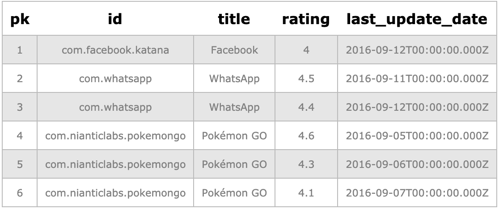
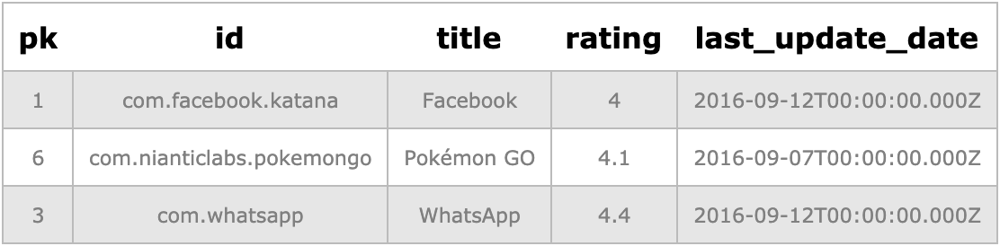

# 42 Matters Test - 3
Here is my solution to task 3 of the 42 Matters test.

1.) Write the SQL code for creating the table '​apps'
2.) Write an SQL query which for each app returns one row, i.e. the row with the most recent ​last_update_date​. (e.g. for WhatsApp it is the row with pk = 3), i.e. the rows with ​pk​ equal to 1, 3 and 6 should be returned by the query and all the fields (i.e. ​pk​, ​id​, t​ itle​, ​rating​, and ​last_update_date​).

## Structure
I have written the SQL with PostgresSQL syntax. And split the commands into three seperate files.

I used https://extendsclass.com/postgresql-online.html as a test environment to run the queries and the results posted will be from this website.

### Create
'create.sql' creates the table. ​I chose to use a SERIAL datatype for the PK as it would create a distinct field automatically and help to make sure there would be no Primary key duplication errors. I chose what I believed would be appropriate datatypes for each of the fields, without constraints on the VARCHAR types, this could probably be tightened up in a production environment.

Running:
```
SELECT *
FROM apps;
```
yielded the following result:


### Insert values
'insert_values.sql' is quite straight forward. It inserts the values from the desired outcome table, excluding the primary key which is generated automatically.

### The latest distinct date
'latest_distinct_date_query.sql' is my solution to the second part of this test. It selects the rows from the table where the title row is distinct and the date for the row is the latest possible using DISTINCT ON. I had considered doing a self join or other method but this appeared to be the easiest method by far and the cleanest to read.

Running the query:
```
SELECT DISTINCT ON (a.title) * 
FROM apps a
ORDER BY a.title, a.last_update_date DESC;
```
Yielded the following result:


## Conclusion
This was a fun problem to solve and helped me gain a better understanding of PostgresSQL's syntax (I have been dealing with Oracle and SnowSQL a lot more recently). As an alternative to the query above, it could have been solved more conventianally like this:
```
SELECT a.*
FROM apps a
inner join
(SELECT id, MAX(last_update_date) AS last_update_date
FROM apps
GROUP BY id) b
ON a.id=b.id AND a.last_update_date=b.last_update_date
ORDER BY a.last_update_date DESC;
```
But I prefered the ease of reading in my solution.

The datatypes could be adjusted depending on what would be required of the table and I could also add NOT NULL constraints etc. I also believe that if the desired result was to only show the latest data for each app it would be better to drop or truncate the rows where the 'title' or 'id' is = to the new data if this were a production table.